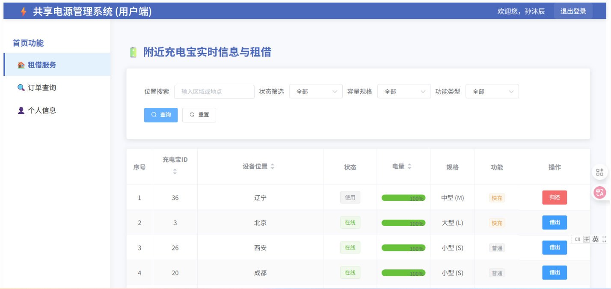
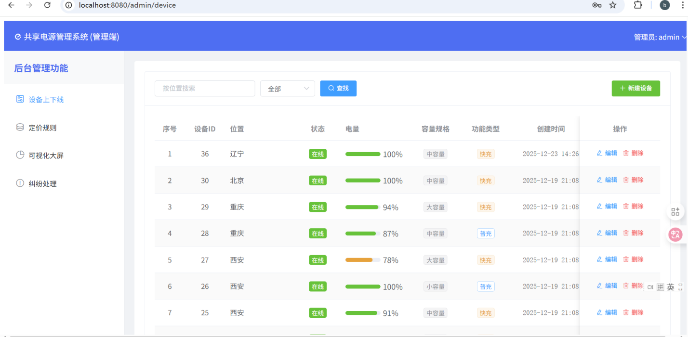

 共享充电宝管理系统

一个基于 `Vue 2 + Flask + MySQL + FISCO-BCOS` 的前后端分离项目，覆盖共享充电宝场景下的用户租借、订单管理、后台运营与链上同步能力。

详细文件: 项目详细文档.md

 项目简介

本项目由三部分组成：

- `power/`：Vue 2 前端，负责用户端与管理员端页面
- `power_bank/`：Flask 后端，负责认证、设备、订单、计费、反馈等业务接口
- `FISCO-BCOS/python-sdk/`：区块链 SDK 依赖，供系统管理与同步模块使用

项目适合作为：

- 课程设计 / 毕业设计参考项目
- Vue + Flask 全栈练手项目
- 区块链与传统业务系统结合的示例项目

 功能特性

- 用户注册、登录与角色区分
- 设备查询、租借、归还
- 订单记录查询与费用结算
- 个人资料维护、余额充值、密码修改、账号注销
- 管理员设备管理
- 管理员计费规则配置
- 管理员反馈 / 纠纷处理
- 运营数据可视化
- 数据库与链上合约的同步机制
- AI 智能客服智能体（问答接口 + RAG 检索 + 数据查询）

 技术栈

 前端

- Vue 2
- Vue Router
- Vuex
- Element UI
- Axios
- ECharts

 后端

- Flask
- Flask-CORS
- PyMySQL
- DBUtils
- sqlparse
- Selenium

 基础设施

- MySQL
- FISCO-BCOS
- WeBASE

 目录结构

```text
E:\power_bank
├─ power/                   前端项目（Vue）
├─ power_bank/              后端项目（Flask）
└─ FISCO-BCOS/python-sdk/   区块链 SDK 依赖
```

核心目录说明：

```
power/src/
├─ router/                  路由配置
├─ store/                   Vuex
├─ utils/request.js         前端请求封装
└─ views/
   ├─ auth/                 登录 / 注册
   ├─ user/                 用户端页面
   └─ admin/                管理端页面

power_bank/app/
├─ auth/                    认证接口
├─ user/                    用户业务接口
├─ admin/                   管理端接口
├─ sysadmin/                链上同步与系统管理逻辑
├─ config.py                Flask 配置
└─ extensions.py            数据库连接池封装
```

 系统架构

```
浏览器 (前端 Vue) 
    -> HTTP API 请求 -> Flask 后端
        -> MySQL 数据库
        -> FISCO-BCOS / WeBASE 链上数据
```

说明：

- 前端开发环境默认请求 `<BACKEND_BASE_URL>`
- 后端启动时会加载数据库配置并初始化表结构
- `sysadmin` 模块会在后台线程中执行链上同步任务


 项目截图

 页面展示 1



 页面展示 2



智能体展示


 AI 智能体

- 接口：`POST /api/assistant/ask`（后端 `power_bank/app/AI/agent/routes.py`）
- 能力：基于本地业务文本（`power_bank/app/AI/data/`）与工具调用（SQL/RAG）返回客服回答
- 配置：`DEEPSEEK_API_KEY`（或 `OPENAI_API_KEY`）、`DEEPSEEK_BASE_URL`
快速开始

1. 启动后端

```bash
cd power_bank
pip install -r requirements.txt
python run.py
```

2. 启动前端

```bash
cd power
npm install
npm run serve
```

环境说明

运行项目之前，请确保以下环境可用：

- Python 3
- Node.js
- MySQL
- FISCO-BCOS
- WeBASE

检查关键配置：

- `power_bank/instance/config.ini` 中的数据库配置
- `power_bank/instance/power_bank.sql` 中的建表脚本
- `power_bank/app/sysadmin/conf.py` 中的链上配置

主要模块

用户端

- 登录注册
- 附近设备查询
- 租借与归还
- 订单记录
- 个人中心

管理端

- 设备管理
- 计费规则配置
- 反馈 / 纠纷处理
- 可视化看板

系统管理模块

- WeBASE 地址获取
- 合约信息同步
- 链下数据与链上数据同步

适用场景

项目亮点

- 展示共享充电宝业务的完整流程
- 展示 Vue + Flask 的典型前后端协作方式
- 展示传统数据库系统与区块链同步的集成思路
- 适合作为课程设计、毕业设计或全栈开发练手项目
License

仅供学习、交流与项目展示使用。
